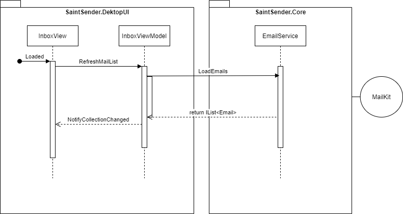

# SaintSender

## Story

Our customer who is insisted of desktop applications on Windows, wants a desktop client to her GMail account which can store the emails offline, on her computer. This customer is a travel agent who is on the road many times without internet connection.
But when she has some free time in the middle of nowhere she wants to continue to work on orders which received via email.

### What she needs

* has pop/imap protocol support for gmail account
* has automatic sync periodically
* has backup and restore functionality for mails and credentials as well
* write and send e-mails

### Feature set

* configuration saved permanently for my gmail account (no need to re-enter e-mail address and password again)
* e-mails are received
* new mails can be sent
* mails backed up to my computer
* mail backup can be restored
* periodically checked server for new mails
* searching in mails with regex

**See details in the full backlog.**

___

## Technical requirements

* MVVM pattern should be applied
* Every *View* should have a proper *ViewModel* class as its DataContext
* **DesktopUI** project should not know of MailKit at all, only *SaintSender.Core*
* Core business logic should be placed in **SaintSender.Core** project independently from the UI:
  * Domain models aka Entities
  * Interfaces
  * Services: e.g. email, backup, credential store
* Classes in core project are unit tested
* We should be able to create a new UI (e.g. CLI, web) without even touching the DesktopUI project
* The communication between layers should be like follows:
    

    The ViewModel is the glue between the view and the backend

> [MailKit](https://github.com/jstedfast/MailKit) is a convenient choice for managing imap/smtp communication

## Gmail less-secure apps

Create a new gmail account just for testing purposes. In your (test) gmail account [you should enable less-secure apps](https://support.google.com/accounts/answer/6010255?hl=en) otherwise Google will block your desktop app's access and deny of responding
